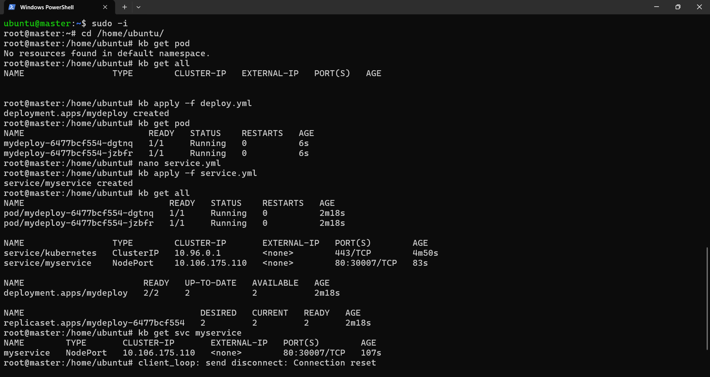
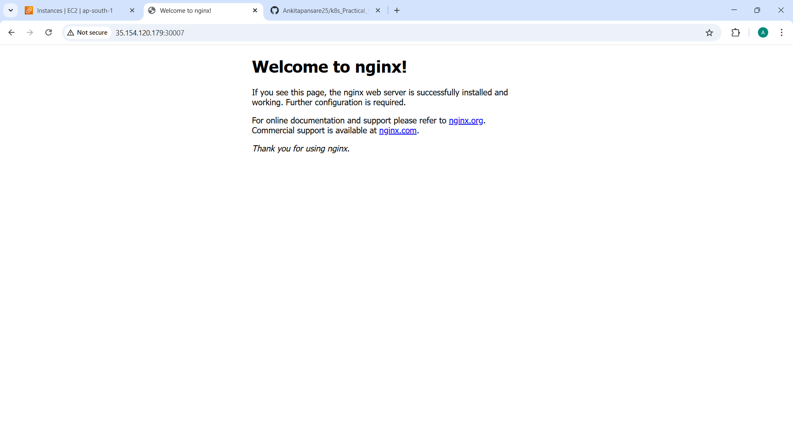

 # k8s_Practical_test

### K8S MCQ 

Q1. What is the smallest unit that Kubernetes deploys?
Ans: B) pod

Q2. Which Kubernetes object is used to expose pods to network traffic?
Ans: c) service

Q3. Which Service type is used only for internal communication inside the cluster?
Ans: c)  ClusterIP

Q4. You want to access an application using <NodeIP>:<Port> 
Which Service type should you use?
Ans: B) NodePort

Q5. Which Service type is mainly used in cloud environments to expose
applications externally?
Ans: c) LoadBalancer

Q6. A pod is deleted accidentally. Which pod type can automatically recreate it?
Ans: c) Pod managed by Deployment

Q7. Which pod type is used to run initialization tasks before the main container
starts?
Ans: B) Init Pod


Q8. Containers inside the same pod communicate using:
Ans: C) Same IP address

Q9. Which Service assigns a stable internal IP address automatically?
Ans: C) ClusterIP 

Q10. You created a Service, but traffic is not reaching the pod.
What is the most common reason?
Ans: B) Label mismatch

Q11. Which Kubernetes component provides DNS-based service discovery?
Ans: C. CoreDNS

Q12. You want a pod to always run on a specific node.
Which pod type is used?
Ans: C) Static Pod

Q13. Which Service type exposes a fixed port on every node?
Ans: B) NodePort

Q14. You want pods inside the cluster to access an application using a DNS name.
Which Service type should you use?
Ans: C) ClusterIP 

Q15. Which command shows the IP address of a pod?
Ans: D) kubectl get pods -o wide

Q16. You created a LoadBalancer Service in a local cluster.
What usually happens?
Ans: 

Q17. Which pod type is commonly used to support a main application with logging
or monitoring?
Ans: C) Sidecar Pod

Q18. Which Service field decides which pods receive traffic?
Ans: C) selector

Q19. Which command is used to list all Services in a namespace?
Ans: B) kubectl get svc

Q20. Two pods in the same namespace want to communicate.
What is the recommended Kubernetes way?
Ans: A) Use pod IP directly

## Practical Assignment 
###s Task:
You are given an application image that runs a web server.
Perform the following steps:

1.Create a Deployment that runs the application with at least 2 pods.

```bash
nano deploy.yml
kb apply -f deploy.yml




2.Ensure all pods are created successfully and are in Running state.

```bash
kb get pod

3.Create a NodePort Service to expose the application.
```bash
nano service.yml
kb apply -f service.yml

4.Access the application from a browser using:
     http://<NodeIP>:<NodePort>

```bash
http://35.154.120.179:30007/

5.Verify that the application output is visible in the browser.

## Output Screenshot




 
